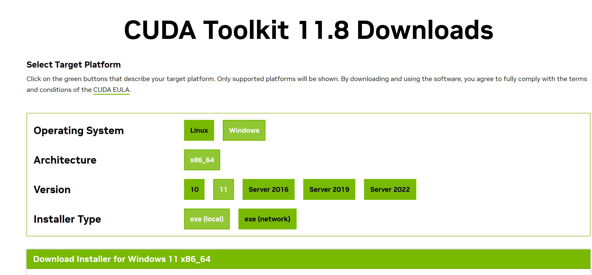
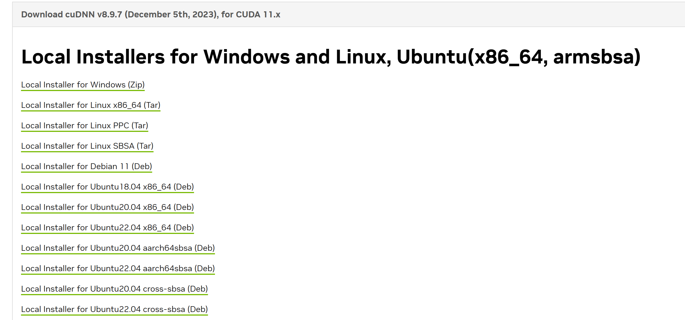
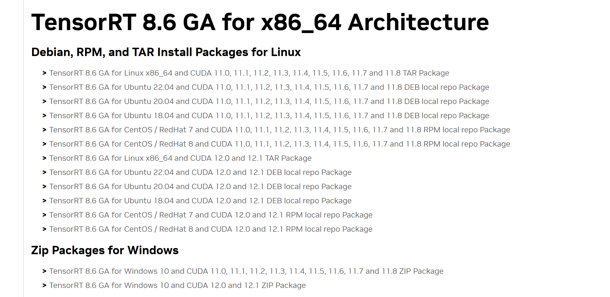
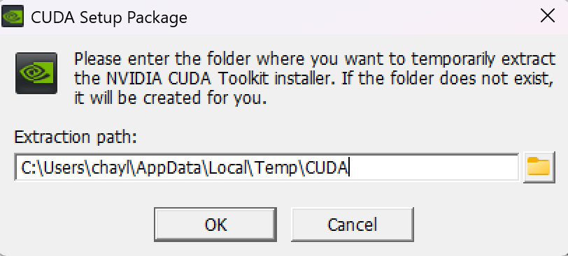
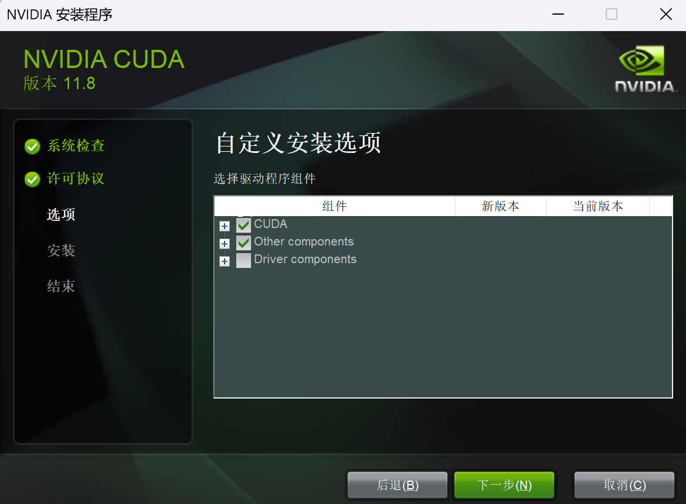

# CUDA 下载

这里选择 [CUDA Toolkit 11.8](https://developer.nvidia.com/cuda-11-8-0-download-archive) ：



选择 [cuDNN v8.9.7](https://developer.nvidia.com/rdp/cudnn-archive)：




选择 [TensorRT-8.6.1.6](https://developer.nvidia.com/nvidia-tensorrt-8x-download)：




# 安装

CUDA 安装：




如果已经有了驱动，可以选择不安装驱动



解压缩 `TensorRT-8.6.1.6.Windows10.x86_64.cuda-11.8.zip` 到 `C:\Program Files\NVIDIA GPU Computing Toolkit\CUDA\TensorRT-8.6.1.6`：


系统环境变量设置:
- `Path` ：`C:\Program Files\NVIDIA GPU Computing Toolkit\CUDA\TensorRT-8.6.1.6\bin`
- `TENSORRT_PATH`：`C:\Program Files\NVIDIA GPU Computing Toolkit\CUDA\TensorRT-8.6.1.6`

解压缩 `cudnn-windows-x86_64-8.9.7.29_cuda11-archive.zip`：复制到 `C:\Program Files\NVIDIA GPU Computing Toolkit\CUDA\cudnn-windows-x86_64-8.9.7.29_cuda11-archive`。


# 验证

```
nvcc -V

trtexec -h
```


